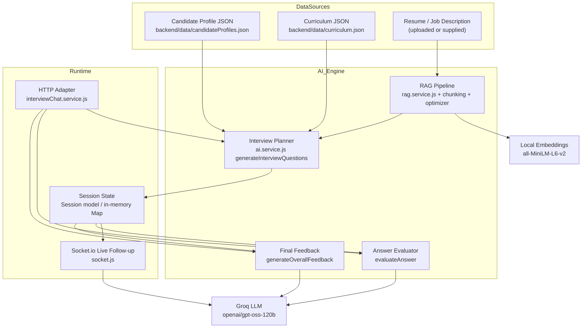
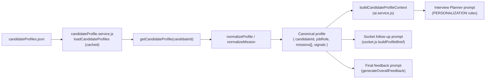
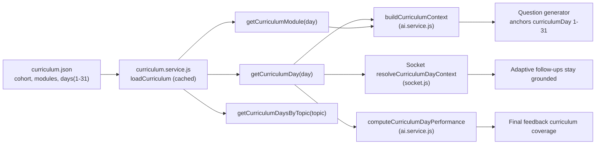
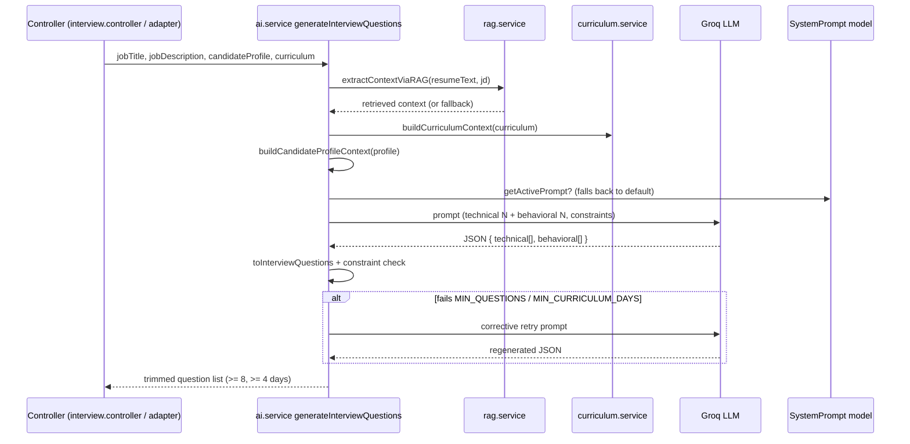
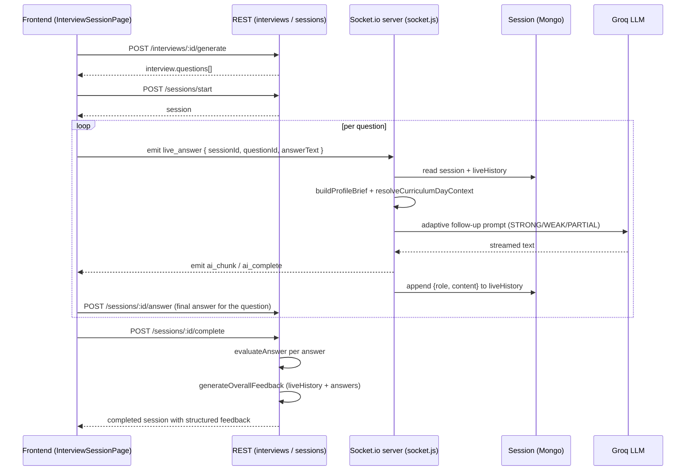
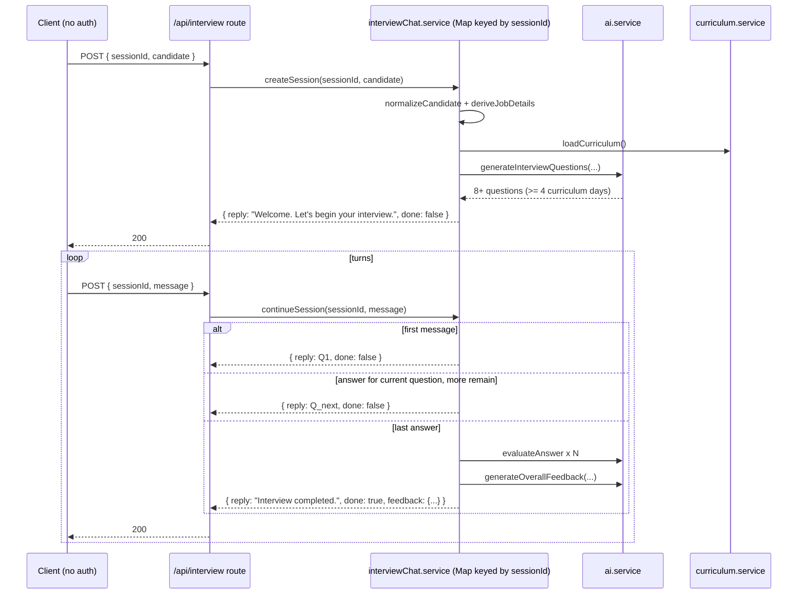
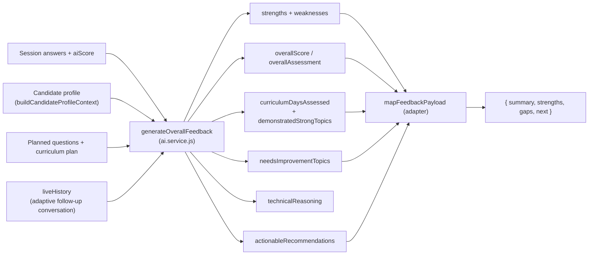

# AI Interviewer — Project Documentation

## 1. Title and short overview

**AI Interviewer** is a full-stack web application that conducts AI-powered mock interviews for candidates. A candidate uploads a resume (or provides a candidate profile), the backend plans a personalized, curriculum-grounded question set, runs a live multi-turn interview, and finally produces a structured feedback report.

**Problem it solves:** Practicing for a technical/behavioral interview usually requires a human interviewer and gives no structured, curriculum-aware feedback. AI Interviewer replaces that with an automated interviewer that:
- personalizes questions to the candidate's profile and learning history,
- grounds questions in an official 31-day AI curriculum,
- runs real-time follow-up conversations over Socket.io,
- and produces a structured, curriculum-day-aware final report.

**One-paragraph system summary:** A React (Vite) frontend talks to an Express backend. The backend uses Groq's `openai/gpt-oss-120b` for all generation/evaluation, a local Hugging Face `all-MiniLM-L6-v2` model for embeddings, an in-process RAG pipeline for retrieval, MongoDB (Mongoose) for persistence, Cloudinary for resume storage, and Redis for job-cache (optional). Interviews can run either through the authenticated REST + Socket.io flow or through a challenge-required unauthenticated `POST /api/interview` adapter that is keyed by a caller-supplied `sessionId`.

---

## 2. Key capabilities

- **Candidate profile–based personalization** — candidate profiles (`backend/data/candidateProfiles.json`) feed the question generator so questions reflect role, experience, mission progress, attempts, and learning signals.
- **Curriculum-based interview grounding** — the official 31-day AI curriculum (`backend/data/curriculum.json`) anchors every question to a real curriculum day/module.
- **RAG pipeline** — resume text + job description → semantic chunking → normalization → embeddings → cosine-similarity retrieval with section boosting (`backend/src/services/rag.service.js`).
- **Multi-turn interview flow** — authenticated flow via `Interview` + `Session` models with per-question answers.
- **Adaptive follow-up questions** — Socket.io `live_answer` handler generates STRONG/WEAK/PARTIAL-aware follow-ups per answer.
- **Structured final feedback** — `generateOverallFeedback` produces strengths, weaknesses, curriculum-day performance, technical reasoning, and actionable recommendations.
- **Socket.io live follow-up** — streaming `ai_chunk` responses during the live session (`backend/src/socket.js`).
- **Challenge-required HTTP adapter** — unauthenticated `POST /api/interview` that maintains state via a `sessionId` and maps directly onto the existing engine (`backend/src/services/interviewChat.service.js`).

---

## 3. Problem statement mapping

This project satisfies the **AI Cohort Interview Agent** challenge in the following ways:

| Challenge requirement | Where it is satisfied |
|---|---|
| Interview an AI Cohort learner | `candidateProfile.service.js` + `candidateProfiles.json` describe the learner (missions, attempts, skipped topics, signals) |
| Ground questions in the official 31-day curriculum | `curriculum.service.js` loads `curriculum.json`; every planned question carries a `curriculumDay` |
| Minimum 8 questions | `ai.service.js:98` `MIN_QUESTIONS = 8`; the generator enforces and retries this constraint |
| At least 4 distinct curriculum days | `ai.service.js:99` `MIN_CURRICULUM_DAYS = 4`; enforced via `meetsPlanningConstraints` + corrective retry |
| Personalized, non-hallucinated questions | `buildCandidateProfileContext` + `buildCurriculumContext` in `ai.service.js` inject only supplied evidence into the prompt |
| Adaptive follow-up during the live interview | `socket.js:138-164` branches on answer strength (STRONG/WEAK/PARTIAL) |
| Structured final feedback | `generateOverallFeedback` (`ai.service.js:409`) produces the full report; the adapter maps it to `{ summary, strengths, gaps, next }` |
| No-auth, `sessionId`-based HTTP endpoint | `POST /api/interview` (`interviewChat.routes.js`, no `protect` middleware) with in-memory `sessionId` state |

The 31-day curriculum and candidate learning journey are first-class inputs: question topics, difficulty, and follow-ups are all derived from the candidate's completed/skipped/unpassed missions and the curriculum day each question anchors to.

---

## 4. High-level architecture



**Role of each subsystem:**

- **Candidate Profile JSON** — source of truth for who the candidate is (role, experience, missions, signals). Loaded by `candidateProfile.service.js`.
- **Curriculum JSON** — the official 31-day/8-module AI curriculum. Loaded/cached by `curriculum.service.js`; used to ground questions and feedback.
- **Resume / JD** — optional RAG source. When a resume is uploaded, its extracted text and the job description feed the retrieval pipeline.
- **RAG pipeline** — chunks, normalizes, embeds, and retrieves the most relevant context so the LLM never invents content.
- **Interview Planner** — generates the 8+ question set spanning ≥4 curriculum days, personalized to the candidate profile.
- **Session State** — for the authenticated flow: Mongo `Session` documents. For the challenge adapter: an in-memory `Map` keyed by `sessionId`.
- **Socket.io Live Follow-up** — real-time adaptive follow-up questions streamed as `ai_chunk`.
- **Final Feedback** — `generateOverallFeedback` compiles per-question scores + conversation history into the structured report.

---

## 5. Repository / folder structure

### Backend (`backend/`)

| Path | Purpose |
|---|---|
| `src/server.js` | Entry point — HTTP + Socket.io server, Redis connect, background schedulers |
| `src/app.js` | Express app — helmet, CORS, rate limit, compression, route mounting |
| `src/socket.js` | Real-time adaptive follow-up Q&A (`live_answer`) |
| `src/config/` | `db.js` (Mongo), `groq.js` (LLM client), `cloudinary.js`, `redis.js`, `logger.js` |
| `src/controllers/` | Route handlers (auth, resume, interview, session, user, jobs, admin…) |
| `src/services/` | Business logic + AI integration (see below) |
| `src/models/` | Mongoose schemas: `User`, `Resume`, `Interview`, `Session`, `SystemPrompt`, `Job`, `Plan`, `Transaction`, `AuditLog`, etc. |
| `src/routes/` | API route definitions |
| `src/middleware/` | `auth.middleware.js` (JWT protect), `upload.middleware.js`, `errorHandler.js`, `validate.js` |
| `src/utils/` | `AppError.js`, `jwt.utils.js`, `normalizer.js` |
| `data/` | `candidateProfiles.json`, `curriculum.json` |

### Key services (`backend/src/services/`)

- **`ai.service.js`** — LLM orchestration: question generation, answer evaluation, overall feedback, parsing, grounding validation.
- **`rag.service.js`** — chunk → embed → cosine-similarity retrieval pipeline.
- **`chunking.service.js`** — semantic, metadata-tagged document splitting.
- **`optimizer.service.js`** — Groq-based query expansion for retrieval.
- **`candidateProfile.service.js`** (new) — loads candidate profiles, `getCandidateProfile(candidateId)` lookup, normalization.
- **`curriculum.service.js`** (new) — loads/caches `curriculum.json`, day/module/topic lookups.
- **`interviewChat.service.js`** (new) — the challenge-required `POST /api/interview` adapter and its `sessionId` state machine.
- **`adzuna.service.js` / `jobSearchService.js` / `jobSyncService.js` / `postgresJobService.js`** — job-board subsystem (optional Adzuna + Postgres sources, cache invalidation).

### Frontend (`frontend/src/`)

| Path | Purpose |
|---|---|
| `pages/` | `LandingPage`, `auth/`, `dashboard/`, `interview/` (List, New, Session, Result), `session/SessionHistoryPage`, `resume/`, `profile/`, `Jobs.jsx`, `RecommendedJobs.jsx`, `admin/` |
| `components/`, `layouts/`, `context/`, `hooks/` | Reusable UI, layout shell, providers, custom hooks |
| `services/` | `api.js`, `auth.service.js`, `interview.service.js`, `admin.service.js` |
| `store/` | `authStore.js` (Zustand) |
| `lib/` | `axios.js`, `adminAxios.js` (axios instances) |

**InterviewSessionPage** is the live interview UI: it starts a session, uses `socket.io-client` to emit `live_answer`, streams `ai_chunk`, and supports speech-to-text (Web Speech API) plus text-to-speech for questions.

---

## 6. Data sources

| Source | File / Storage | Used by |
|---|---|---|
| Candidate Profiles | `backend/data/candidateProfiles.json` | `candidateProfile.service.js` → question generator + feedback |
| Curriculum | `backend/data/curriculum.json` | `curriculum.service.js` → grounding + feedback |
| Resume / JD | Cloudinary (`fileUrl`) + `Resume.extractedText` | `resume.controller.js` → RAG |
| Users / Interviews / Sessions | MongoDB (Mongoose models) | `User`, `Interview`, `Session` |
| Session history | `Session.liveHistory` array | `socket.js`, `generateOverallFeedback` |
| Final evaluation output | `Session` structured fields + adapter `feedback` payload | `session.controller.js`, `interviewChat.service.js` |
| System prompt templates | MongoDB `SystemPrompt` collection | `ai.service.js`, `socket.js` |
| Job cache | Redis (`jobs:*` keys) | jobs subsystem |

---

## 7. Candidate profile flow

`candidateProfile.service.js` reads `candidateProfiles.json` (cached in memory), and `getCandidateProfile(candidateId)` returns the normalized profile for a candidate id. The profile file supports both a `{ member: {...} }` wrapper and flat entries; `normalizeMission`/`normalizeProfile` produce a canonical shape.

The normalized profile drives:
- **Missions (passed/skipped/unpassed)** — passed missions become likely question topics; skipped/unpassed missions are targeted for verification.
- **Attempts** — high attempt counts signal weak areas worth probing.
- **Signals** (e.g. `commitDays`, `missionsCompleted`, `missionsFirstTry`) — influence personalization in the prompt.
- **`jobRole` / `yearsExperience` / `education`** — drive difficulty and role relevance.



---

## 8. Curriculum flow

`curriculum.service.js` loads `curriculum.json` once and caches it in memory (`loadCurriculum`). Helpers expose:

- `getCurriculumDay(day)` — the day entry (title, type, tools, objectives).
- `getCurriculumModule(day)` — the module whose day-range contains the day.
- `getCurriculumDaysByTopic(topic)` — fuzzy topic → matching days.
- `reloadCurriculum()` — drops the cache for re-reads.

`ai.service.js` builds a curriculum context block (`buildCurriculumContext`) and requires each question to anchor to a real day. `socket.js` resolves the day/module context for the current question (`resolveCurriculumDayContext`) so follow-ups stay on-topic.



---

## 9. RAG pipeline

The RAG pipeline lives in `rag.service.js` and is used to retrieve context for question generation (and, in other helpers, for topic retrieval). It is entirely in-process and does not require OpenAI — embeddings come from the local Hugging Face `Xenova/all-MiniLM-L6-v2` model via `@langchain/community`.

Steps:

1. **Chunking** (`chunking.service.js`) — `chunkResumeAndJD(resumeText, jdText)` detects resume/JD section headers, tags each chunk with `{ type, section }`, and splits into ≤300-token sentence-safe pieces.
2. **Normalization** (`utils/normalizer.js`) — strips noise (BOM, bullets, emails, URLs), expands abbreviations (JS → JavaScript) while protecting technical tokens.
3. **Embeddings** — `HuggingFaceTransformersEmbeddings` embeds each chunk locally.
4. **Query optimization** (`optimizer.service.js`) — Groq rewrites the fixed retrieval goals into context-rich queries.
5. **Retrieval** — cosine similarity between query and chunk vectors, multiplied by a `SECTION_BOOST` weight (skills/experience/responsibility rank higher), de-duplicated, top-K (default 6) returned as labeled context.

```mermaid
flowchart LR
    A["Resume text + Job description"] --> B["chunking.service.js<br/>chunkResumeAndJD"]
    B --> C["Semantic chunks<br/>metadata { type, section }"]
    C --> D["utils/normalizer.js<br/>normalizeChunks"]
    D --> E["HuggingFace embeddings<br/>Xenova/all-MiniLM-L6-v2"]
    E --> F["In-memory vector store"]
    F --> G["optimizer.service.js<br/>Groq query rewrite"]
    G --> H["Cosine similarity + SECTION_BOOST"]
    H --> I["Top-K retrieved context (labeled)"]
    I --> J["generateInterviewQuestions<br/>strict grounding: no hallucination"]
```



---

## 10. Interview generation flow

`generateInterviewQuestions` (in `ai.service.js`) combines:

- **RAG context** — `extractContextViaRAG(resumeText, jobDescription)` (fallback to raw text when empty/unavailable).
- **Candidate profile context** — completed/skipped/unpassed missions, attempts, signals.
- **Curriculum context** — the full day-by-day curriculum so questions map to real days/modules/tools.

The prompt distributes ~2/3 technical and ~1/3 behavioral questions and mandates at least `MIN_QUESTIONS` (8) covering at least `MIN_CURRICULUM_DAYS` (4) distinct curriculum days. If the first response fails the constraint, a single corrective retry is attempted; the result is then sliced to the effective target (never below 8).



---

## 11. Multi-turn interview flow

### Authenticated REST + Socket.io flow

1. `POST /api/interviews` creates an `Interview` (draft).
2. `POST /api/interviews/:id/generate` runs the planner and stores `interview.questions`.
3. `POST /api/sessions/start` creates a `Session` (answers `[]`, `liveHistory` `[]`).
4. The candidate answers each question; `POST /api/sessions/:id/answer` appends answers.
5. Live follow-ups run over Socket.io: frontend emits `live_answer`, `socket.js` generates an adaptive follow-up (streamed via `ai_chunk`), and both user/assistant turns are appended to `session.liveHistory`.
6. `POST /api/sessions/:id/complete` evaluates every answer (`evaluateAnswer`), generates the report (`generateOverallFeedback`), and finalizes the session.

The socket handler is bounded (`MAX_LIVE_EXCHANGES_PER_QUESTION = 3`, `MAX_LIVE_TOTAL_EXCHANGES = 20`) and branches on answer strength (STRONG → deeper probe; WEAK → foundational probe; PARTIAL → missing-concept probe).



---

## 12. Challenge HTTP adapter — `POST /api/interview`

Files: `backend/src/routes/interviewChat.routes.js`, `backend/src/controllers/interviewChat.controller.js`, `backend/src/services/interviewChat.service.js`. Mounted in `app.js` as `app.use('/api/interview', interviewChatRoutes)` with **no** `protect` middleware.

### Request formats

**New session:**
```json
{
  "sessionId": "abc-123",
  "candidate": { "member": { "jobRole": "AI Engineer", "yearsExperience": 4, ... }, "missions": [...], "signals": {...} }
}
```

**Subsequent turn:**
```json
{ "sessionId": "abc-123", "message": "..." }
```

### Response formats

**In progress:**
```json
{ "reply": "...", "done": false }
```

**Complete:**
```json
{
  "reply": "Interview completed.",
  "done": true,
  "feedback": { "summary": "...", "strengths": [], "gaps": [], "next": [] }
}
```

### How state is maintained

State lives in an in-memory `Map` keyed by `sessionId` (`sessions` in `interviewChat.service.js`). Each session holds the normalized profile, curriculum, the planned questions, `askedIndex`, `answers[]`, `liveHistory[]`, and status (`created → asking → done`). Unknown `sessionId` → 404; missing `sessionId` → 400; re-posting to a completed session replays the completed report.

### How it maps to the existing engine

- `createSession` → `normalizeCandidate` + `deriveJobDetails` + `loadCurriculum` → `generateInterviewQuestions` (the exact existing planner, so RAG/profile/curriculum constraints still apply).
- `continueSession` → walks the planned questions; each message is stored as an answer + liveHistory entry.
- On the last answer → `finalizeFeedback` → `evaluateAnswer` per answer → `generateOverallFeedback`, then maps the report to the contract shape via `mapFeedbackPayload` (`overallAssessment → summary`, `demonstratedStrongTopics/strengths → strengths`, `needsImprovementTopics/weaknesses → gaps`, `actionableRecommendations/improvementTips → next`).



---

## 13. Final feedback system

`generateOverallFeedback` (`ai.service.js:409`) produces the full report from the candidate profile, the planned curriculum coverage, per-question scores/answers, and the live follow-up history. It emits:

- `overallScore` (1–100)
- `overallAssessment`
- `strengths` / `weaknesses`
- `improvementTips`
- `curriculumDaysAssessed`
- `demonstratedStrongTopics` / `needsImprovementTopics`
- `technicalReasoning`
- `actionableRecommendations`

The authenticated flow persists these onto `Session` (`session.controller.js:149-155`). The challenge adapter maps them into the exact contract fields:

| Contract field | Source |
|---|---|
| `summary` | `overallAssessment` |
| `strengths` | `demonstratedStrongTopics` → `strengths` (fallback `['Interview completed']`) |
| `gaps` | `needsImprovementTopics` → `weaknesses` (fallback `[]`) |
| `next` | `actionableRecommendations` → `improvementTips` (fallback `[]`) |

`computeCurriculumDayPerformance` averages per-day scores from planned `curriculumDay` values so the report can name exact days the candidate covered.



---

## 14. API reference

### Existing (authenticated with JWT via `protect`)

| Method | Endpoint | Description |
|---|---|---|
| `POST` | `/api/auth/register` | Register user |
| `POST` | `/api/auth/login` | Login → access token |
| `POST` | `/api/auth/refresh` | Refresh token |
| `GET` | `/api/auth/me` | Current user |
| `POST` | `/api/auth/logout` | Logout |
| `POST` | `/api/resumes/upload` | Upload resume (multipart `resume`) |
| `GET` | `/api/resumes` | List resumes |
| `DELETE` | `/api/resumes/:id` | Delete resume |
| `PATCH` | `/api/resumes/:id/default` | Set default resume |
| `POST` | `/api/resumes/:id/parse` | AI-parse resume |
| `POST` | `/api/interviews` | Create interview (draft) |
| `POST` | `/api/interviews/:id/generate` | Generate questions |
| `GET` | `/api/interviews` / `:id` | List / get interviews |
| `DELETE` | `/api/interviews/:id` | Delete interview |
| `POST` | `/api/sessions/start` | Start session |
| `POST` | `/api/sessions/:id/answer` | Save/evaluate an answer |
| `POST` | `/api/sessions/:id/complete` | Evaluate all + generate report |
| `GET` | `/api/sessions` / `:id` | List / get sessions |
| `GET` | `/api/users/profile` / `dashboard` | User profile / stats |
| `PUT` | `/api/users/profile` / `change-password` | Update profile / password |
| `GET` | `/api/jobs` , `/api/jobs/:id`, `/api/jobs/recommended`, `/api/jobs/categories` | Job board |
| `POST` | `/api/jobs/generate-questions` | Direct question generation |
| `POST` | `/api/jobs/search` | Live Adzuna search |
| `/api/admin/*` | admin routes | Protected admin panel (stats, users, jobs, prompts, plans, scraper, settings, analytics, logs) |

### Challenge endpoint (NO authentication)

| Method | Endpoint | Description |
|---|---|---|
| `POST` | `/api/interview` | `{ sessionId, candidate }` starts; `{ sessionId, message }` continues; final turn returns `{ reply, done: true, feedback }` |

Socket.io events: frontend emits `live_answer`; server streams `ai_chunk`, then `ai_complete` (or `ai_error`).

---

## 15. Environment setup

### Prerequisites

- Node.js v18+ (backend requires `mongodb` driver v8+ compatibility; README lists v18+)
- MongoDB (Atlas or local) — required for the authenticated flow and for `SystemPrompt`/`User`/`Interview`/`Session`
- Redis or Memurai — optional, gated by `REDIS_ENABLED`; caches job results
- Groq API key — required for all LLM generation/evaluation
- Cloudinary account — required for resume file storage
- Adzuna API (optional) — job board source
- OpenAI API key — listed in `.env.example`; note: the current RAG pipeline uses local Hugging Face embeddings and does **not** require OpenAI at runtime

### Environment variables (backend/.env)

| Variable | Required | Purpose |
|---|---|---|
| `PORT` | yes | HTTP port (default 5000) |
| `NODE_ENV` | yes | `development` / `production` / `test` |
| `MONGO_URI` | yes | MongoDB connection string |
| `JWT_SECRET` | yes | Access-token signing |
| `JWT_REFRESH_SECRET` | yes | Refresh-token signing |
| `GROQ_API_KEY` | yes | Groq LLM |
| `OPENAI_API_KEY` | optional | Currently unused by the RAG pipeline (local embeddings) |
| `CLOUDINARY_CLOUD_NAME/API_KEY/API_SECRET` | yes* | Resume storage (*required for resume upload) |
| `CLIENT_URL` | yes | CORS origin (frontend) |
| `RATE_LIMIT_WINDOW_MS`, `RATE_LIMIT_MAX` | optional | Global `/api` rate limit |
| `REDIS_ENABLED`, `REDIS_URL`/`REDIS_HOST`/`REDIS_PORT` | optional | Job cache |
| `ADZUNA_APP_ID`, `ADZUNA_APP_KEY`, `ADZUNA_COUNTRY` | optional | Job search |
| `CURRICULUM_PATH`, `CANDIDATE_PROFILES_PATH` | optional | Override data JSON paths |

**Current working setup:** Mongo + Groq are the only hard requirements for the core interview flow. Redis can be disabled (`REDIS_ENABLED=false`). Resume upload needs Cloudinary. The challenge adapter needs only Groq and the data JSON files.

---

## 16. How to run locally

```bash
# Backend
cd backend
npm install
cp .env.example .env          # fill in MONGO_URI, GROQ_API_KEY, JWT secrets, etc.
npm run dev                   # starts nodemon on port 5000

# Frontend (separate terminal)
cd frontend
npm install
cp .env.example .env          # VITE_API_URL=http://localhost:5000
npm run dev                   # Vite on port 5173
```

**Starting Redis/Memurai (optional):** start a local Redis server (or Memurai on Windows) on 127.0.0.1:6379, or set `REDIS_URL`; set `REDIS_ENABLED=true` (default). The backend connects on boot and logs Redis connection state.

**Testing the challenge endpoint:**

```bash
# 1) Start session
curl -X POST http://localhost:5000/api/interview \
  -H "Content-Type: application/json" \
  -d '{"sessionId":"test-001","candidate":{"member":{"jobRole":"AI Engineer","yearsExperience":4},"missions":[{"title":"Embeddings","passed":true}]}}'

# 2) Continue (repeat until done:true)
curl -X POST http://localhost:5000/api/interview \
  -H "Content-Type: application/json" \
  -d '{"sessionId":"test-001","message":"My answer..."}'
```

---

## 17. Testing checklist

- **Registration/login** — `POST /api/auth/register`, `POST /api/auth/login` → token; protected routes reject without it.
- **Resume upload** — `POST /api/resumes/upload` with a PDF; `extractedText` populated; Cloudinary URL stored; `POST /api/resumes/:id/parse` returns structured data.
- **Interview generation** — `POST /api/interviews` then `POST /api/interviews/:id/generate` → ≥8 questions spanning ≥4 curriculum days, `generationStatus: 'generated'`.
- **Socket.io follow-up** — during a session, `live_answer` produces streamed `ai_chunk` adaptive follow-ups; `liveHistory` grows.
- **Final feedback** — `POST /api/sessions/:id/complete` populates `overallScore`, `overallAssessment`, `strengths`, `areasForImprovement`, `curriculumDaysAssessed`, `actionableRecommendations`.
- **POST /api/interview** — full happy path: create → N message turns → `done: true` with `feedback.summary/.strengths/.gaps/.next`.
- **Error cases** — missing `sessionId` → 400; unknown `sessionId` → 404; re-posting to a completed session → completed report replay (200).

---

## 18. Design decisions

- **Candidate profile personalization** — the challenge centers on interviewing a cohort learner, so missions/attempts/signals are injected into the prompt to make questions genuinely personal rather than generic.
- **Curriculum grounding** — the official 31-day curriculum is the shared vocabulary of the cohort; anchoring each question to a real day prevents hallucination and enables day-level feedback.
- **Local embeddings** — a local Hugging Face `all-MiniLM-L6-v2` model avoids an OpenAI dependency for RAG, works fully in-process, and keeps retrieval self-contained.
- **`sessionId`-based state** — the challenge contract requires a stateless-looking HTTP endpoint keyed by a caller-supplied `sessionId`; an in-memory `Map` keeps it simple and requires no auth token or DB writes.
- **Adapter instead of rewrite** — the existing engine (planner, evaluator, feedback generator, curriculum/profile services) already implements the challenge logic; `POST /api/interview` is a thin orchestration layer over it, so the whole app was not rewritten.

---

## 19. Limitations and risks

- **In-memory session store** — the challenge adapter keeps sessions in a process-local `Map`; restarting the server (or running multiple instances) drops all active interviews and their partial answers.
- **Multi-instance / restart risk** — no shared state or persistence for `sessionId`; horizontal scaling or a redeploy invalidates in-flight sessions. The authenticated Mongo-backed flow is not affected.
- **Duplicate `sessionId` creates** — re-posting `{ sessionId, candidate }` for an existing, still-running session returns the welcome reply instead of resetting; this is a deliberate idempotence choice, not a reset.
- **No TTL eviction** — the adapter prunes the map only when it grows large; abandoned sessions are not time-expired.
- **Adaptive follow-up is Socket.io-only** — the adapter advances through planned questions; the STRONG/WEAK/PARTIAL live adaptivity lives in `socket.js`, not in `POST /api/interview`.
- **`evaluateAnswer` in the adapter uses empty `expectedKeywords`** (`interviewChat.service.js`) — the adapter's per-answer scoring does not pass the planned question's keywords, slightly reducing grading fidelity compared to the session flow.
- **Non-atomic feedback generation** — if the LLM feedback call fails, the adapter falls back to a minimal `feedback` payload and marks the session done.
- **RAG model download** — the first embedding run may download `Xenova/all-MiniLM-L6-v2`; offline/first-boot latency is possible. RAG has a graceful fallback to raw context text.
- **Frontend coverage** — the challenge adapter has no dedicated UI page; it is exercised via HTTP/tests only.

---

## 20. Future improvements

- **Persistent session store** — back the adapter with MongoDB (or Redis) so `sessionId` state survives restarts and can be horizontally shared.
- **Horizontal scaling** — move `sessionId` state out of the process map and add a session registry, enabling multiple backend instances behind a load balancer.
- **Better curriculum analytics** — richer per-day/module metrics (streak vs. one-off correctness, topic decay over time) feeding both feedback and future question selection.
- **Stronger answer grading** — pass planned `expectedKeywords` and per-day context into the adapter's `evaluateAnswer` for fidelity parity with the session flow.
- **Optional UI polish** — a dedicated challenge-adapter demo page (start session → chat → result) and first-run RAG model warm-up / progress indicator.

---

## Project at a glance

- **Stack:** Node.js + Express, MongoDB (Mongoose), Socket.io, Groq (`openai/gpt-oss-120b`), local Hugging Face embeddings (`all-MiniLM-L6-v2`), React 18 + Vite, Zustand, Tailwind.
- **Core value:** personalized, curriculum-grounded, adaptively-probed mock interviews with structured, day-level feedback.
- **Two interview paths:** authenticated REST + Socket.io sessions, and the unauthenticated `POST /api/interview` adapter keyed by `sessionId`.
- **Constraints honored:** ≥8 questions, ≥4 curriculum days, no-auth adapter, exact `{ summary, strengths, gaps, next }` feedback contract.

## Most important implementation highlights

- **Reuse-first adapter:** `interviewChat.service.js` implements the challenge endpoint purely as orchestration over the existing planner, evaluator, and feedback generator — no rewrite, no package changes.
- **Grounded generation:** `ai.service.js` fuses RAG context, candidate profile, and the 31-day curriculum into one strict-grounding prompt with a corrective retry for constraint violations.
- **Truly adaptive live interviews:** `socket.js` classifies each answer (STRONG/WEAK/PARTIAL) and probes accordingly, bounded to prevent runaway depth.
- **Structured, evidence-based reports:** `generateOverallFeedback` turns answers + conversation + curriculum coverage into strengths, gaps, technical reasoning, and actionable, curriculum-anchored next steps.
